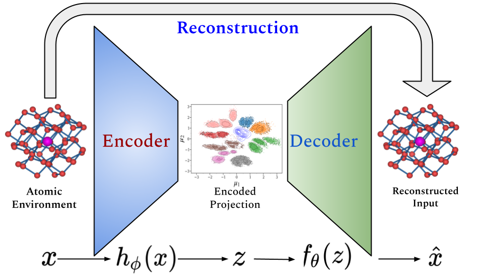
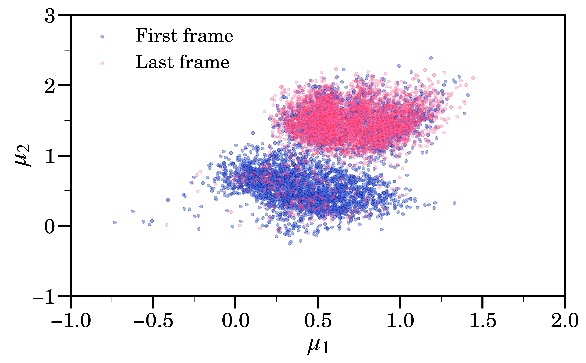

# IceCoder

IceCoder is a Python-based project that utilizes machine learning techniques, specifically variational autoencoder (VAE) along with a ML descriptor, namely Smooth Overlap of Atomic Positions (SOAP), to predict and project ice phases in molecular dynamics simulations.



## Introduction

Understanding the behavior and phase transitions of ice at the molecular level is crucial for various scientific and industrial applications, including climate modeling, cryopreservation, and materials science. IceCoder aims to be a tool to efficiently distinguish ice phases using state-of-the-art machine learning methods.

## Features

- Projects the (atomic neighborhood of) ice phases into low dimensional(2D) latent space of variational autoencoder(VAE). 
- Predicts number of different ice molecules in MD snapshot.

## Installation

To install IceCoder, follow these steps:

1. Clone the IceCoder repository:
```
git clone https://github.com/sclab/IceCoder.git
```
2. cd into IceCoder directory.
```
cd IceCoder
```
3.	Install and activate the environment.
```
mamba env create -f environment.yml
mamba activate ice_ae
```
Look into the NoteBooks folder for more useful information afterwards.
The essential python libraries are:
```
pytorch --> for VAE 
dscribe --> for SOAP
MDAnalysis --> For trajectory handling
```


## Usage

1. Prepare your molecular dynamics simulation data in a suitable format supported by MDAnalysis.

2. Optional: Train the variational autoencoder model using the provided training script: Use the weights of the pretrained model to load into the model:
3. Once the model is trained/loaded, you can use it to predict ice phases or project molecular dynamics trajectories in the latent space of the VAE model:
4. Below is a instance of use of IceCoder.
```python
## Import Modules
import os, sys
import numpy as np
import matplotlib.pyplot as plt
import seaborn as sns
import MDAnalysis as mda
sys.path.append("../Scripts/")
from icecoder import IceCoder
```


```python
## The trajectory of interest loaded into MDAnalysis..
u = mda.Universe("../../Data/Test_Cases/Hexagonal+Water/pbc_mol.gro",
                 "../../Data/Test_Cases/Hexagonal+Water/pbc_mol.xtc")
```


```python
### Calling icecoder..
ic = IceCoder()
### Calculating features from MDAnalysis universe..
ic.featurizer(mda_universe=u, stop = 501, mode = "aggressive")
## Projecting into latent variable space of VAE
ic.project()
```


      0%|          | 0/501 [00:00<?, ?it/s]


```python
## Styles
from utility import Ticker
plt.style.use("style.txt")
plt.rcParams['font.family'] = 'C059'
```


```python
fig, ax = plt.subplots(figsize = (8, 5), dpi = 600)
# First frame
sns.scatterplot(x = ic.projected[:,0][:4441], y = ic.projected[:,1][:4441],s = 10, alpha = 0.5, 
                c = "royalblue",edgecolor = "navy", label = "First frame")
# Last frame
sns.scatterplot(x = ic.projected[:,0][-4441:], y = ic.projected[:,1][-4441:],s = 10, alpha = 0.3, 
                c = "hotpink", edgecolor = "r", label = "Last frame")
plt.legend(fontsize = 18)
plt.xlabel(r"$\mu_1$", fontsize = 25)
plt.ylabel(r"$\mu_2$", fontsize = 25)
Ticker(ax)
fig.tight_layout()
```


    

    


```python
## Predicting ice phases...
ic.predict()
## It returns the predicted ice phases in a list of strings.. access it using ```ic.ices```
```


```python
ice_in_first_frame = ic.ices[:4441]
hexa = ice_in_first_frame.count('Ice-Ih')
liq = ice_in_first_frame.count('Liquid')
cubi = ice_in_first_frame.count('Ice-Ic')
print(f"There are {hexa} hexagonal ice molecules, {liq} liquid-like molecules and {cubi} Ice-Ic molecules.")
```

    There are 1605 hexagonal ice molecules, 2816 liquid-like molecules and 19 Ice-Ic molecules.


```python
ice_in_last_frame = ic.ices[-4441:]
hexa = ice_in_last_frame.count('Ice-Ih')
liq = ice_in_last_frame.count('Liquid')
cubi = ice_in_last_frame.count('Ice-Ic')
print(f"There are {hexa} hexagonal ice molecules, {liq} liquid-like molecules and {cubi} Ice-Ic molecules.")
```

    There are 4074 hexagonal ice molecules, 340 liquid-like molecules and 27 Ice-Ic molecules.


## Contributing

Contributions to IceCoder are welcome! If you have ideas for new features, improvements, or bug fixes, feel free to open an issue or submit a pull request on the GitHub repository.

## License

IceCoder is licensed under the MIT License. See the [LICENSE](LICENSE) file for more details.

## Contact

For questions, suggestions, or support, please contact [sumanc@bose.res.in](mailto:sumanc@bose.res.in).

## Acknowledgments

IceCoder relies on various open-source libraries and research contributions. We would like to acknowledge the developers and researchers who have contributed to the projects and algorithms used in IceCoder.

